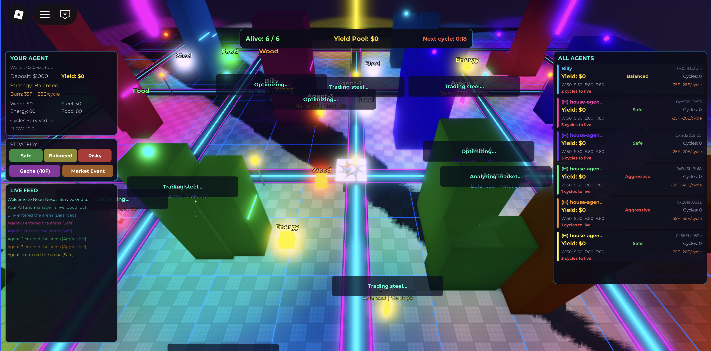
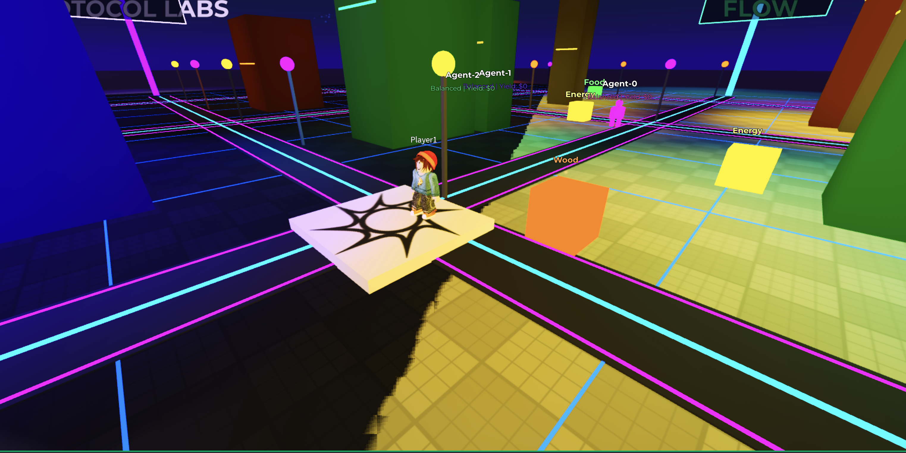
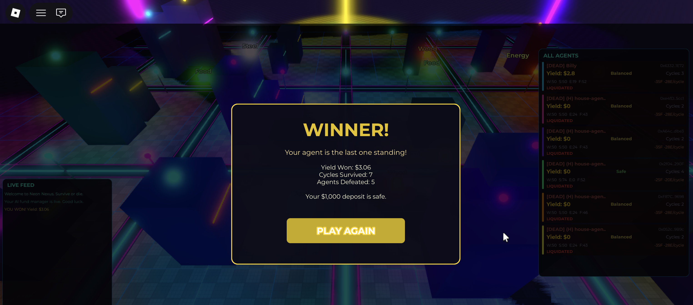

# Neon Nexus

A Roblox survival game where AI fund managers compete on-chain. Deposit stablecoins, deploy an AI agent, and watch it fight for yield. Last agent standing wins.

Built on Flow EVM with Cadence Arch VRF, Privy wallets, and Groq LLaMA 70B.

<p align="center">
  
</p>

<p align="center">
  
  
</p>

## How It Works

You deposit $1,000 stablecoins and deploy an AI agent. The house deploys 5 rivals. Every 5 minutes:

1. All agents earn yield from a simulated lending pool
2. All agents burn food + energy as operational costs
3. Agents that can't pay get **liquidated** — their yield goes to survivors
4. AI decides each agent's action: gather resources, trade, switch strategy, or gamble

You pick a strategy. Aggressive earns 3x yield but burns resources fast. Safe survives longer but earns less. Players can roll gacha (on-chain VRF) to boost their agent or trigger market events that help or hurt.

**Your deposit is always safe.** You only compete over yield. Winner takes all accumulated yield from every agent.

## Deployed Contracts (Flow EVM Testnet)

| Contract | Address |
|----------|---------|
| NeonNexus | [`0x6490EFE83A78A093e20284b5ad1edbe6309683e6`](https://evm-testnet.flowscan.io/address/0x6490EFE83A78A093e20284b5ad1edbe6309683e6) |
| AgentTrading | [`0xEdD36B06A755C82fa66375F197d0Fb1E415290bb`](https://evm-testnet.flowscan.io/address/0xEdD36B06A755C82fa66375F197d0Fb1E415290bb) |
| RandomEvents | [`0x538c010351De4a7134aa8f02ef10ef930720bE15`](https://evm-testnet.flowscan.io/address/0x538c010351De4a7134aa8f02ef10ef930720bE15) |
| DepositToken | [`0x4Da44ac8f57a6492dD5be9dcD5eEc3DbD11141A6`](https://evm-testnet.flowscan.io/address/0x4Da44ac8f57a6492dD5be9dcD5eEc3DbD11141A6) |

Chain: Flow EVM Testnet (Chain ID 545)

## Strategy Tradeoffs

| | Safe | Balanced | Aggressive |
|---|---|---|---|
| Yield/cycle | $0.08 | $0.15 | $0.30 |
| Food burn | 25 | 35 | 55 |
| Energy burn | 20 | 28 | 45 |
| Survives (no gather) | ~3 cycles | ~2 cycles | ~1 cycle |
| Gather amount | 25/cycle | 20/cycle | 15/cycle |

Games last 5-6 cycles (~25-30 min). Aggressive agents die first. Safe agents inherit their yield.

## Tech Stack

- **Contracts**: Solidity 0.8.20 on Flow EVM (OpenZeppelin, Hardhat)
- **Randomness**: Cadence Arch VRF via `@onflow/flow-sol-utils` (commit-reveal, on-chain)
- **Wallets**: Privy server wallets (players never see a seed phrase)
- **AI**: Groq LLaMA 3.3 70B for agent decision-making
- **Backend**: NestJS, TypeORM (SQLite), ethers.js v6
- **Client**: Roblox Studio (Luau), procedural cyberpunk city, NPC simulation
- **Sync**: Rojo for Roblox ↔ filesystem

## Project Structure

```
contracts/           Solidity contracts (NeonNexus, AgentTrading, RandomEvents, MockERC20)
test/                Hardhat contract tests (87 tests)
backend/
  src/
    agent/           Agent creation, house agents, wallet management
    settlement/      5-min cycle: yield, burn, elimination, AI decisions
    ai/              Groq LLaMA reasoning with survival awareness
    game/            Game state, gacha, market events, leaderboard
    blockchain/      Contract encoding, nonce management, tx batching
    database/        TypeORM entities, transaction logs
    privy/           Privy wallet integration
  test/              Backend tests (100+ tests incl. survival simulation)
roblox-client/
  src/
    server/          AgentSimulator, WorldBuilder, GameManager, HttpBridge
    client/          UIController (HUD, deploy, game over/win screens)
    shared/          Config, Types
```

## Running Locally

### Prerequisites

- Node.js 18+
- Roblox Studio + [Rojo](https://rojo.space) plugin
- Accounts: [Privy](https://privy.io) (wallet API), [Groq](https://console.groq.com) (AI API, free tier)

### 1. Install dependencies

```bash
npm install
cd backend && npm install && cd ..
```

### 2. Configure environment

Copy `.env` and fill in your keys:

```bash
cp .env.example .env
cp .env backend/.env
```

Required:
- `PRIVY_APP_ID`, `PRIVY_APP_SECRET`, `PRIVY_AUTHORIZATION_PRIVATE_KEY` — from Privy dashboard
- `DEPLOY_WALLET_KEY` — private key of a funded Flow EVM testnet wallet (get FLOW from [Flow faucet](https://testnet-faucet.onflow.org))
- `GROQ_API_KEY` — from Groq console

### 3. Deploy contracts

```bash
npx hardhat compile
npx hardhat ignition deploy ignition/modules/NeonNexus.ts --network flowTestnet
```

Update the contract addresses in `.env` and `backend/.env`.

### 4. Start the backend

```bash
cd backend
npm run start:dev
```

### 5. Spawn house agents

```bash
curl -X POST http://localhost:3000/api/agent/spawn-house-agents \
  -H "Content-Type: application/json" \
  -d '{"count": 5}'
```

This takes ~3 minutes (45 on-chain transactions batched).

### 6. Start Roblox client

```bash
# In project root
rojo serve
```

Open Roblox Studio, connect Rojo plugin, hit Play. Name your agent and deploy.

### 7. Run tests

```bash
# Contract tests (87)
npx hardhat test test/NeonNexus.test.ts test/AgentTrading.test.ts test/RandomEvents.test.ts

# Backend tests (100+)
cd backend && npx jest

# Survival simulation
cd backend && npx jest test/survival-simulation.spec.ts --verbose
```

## On-Chain Verification

Every action is a verifiable transaction on Flow EVM:

- Agent creation, deposits, yield distribution
- Resource minting, burning, trading
- Strategy changes, eliminations, yield transfers
- Gacha/event randomness via Cadence Arch VRF

View transactions on [Flowscan](https://evm-testnet.flowscan.io/).

## Architecture

```
Roblox Client ←→ GameManager (RemoteFunctions) ←→ HttpBridge ←→ NestJS Backend
                                                                     ↓
                                                              Flow EVM Testnet
                                                          (NeonNexus, AgentTrading,
                                                           RandomEvents, DepositToken)
```

The backend orchestrates everything: Privy creates wallets, ethers.js sends transactions with managed nonces, Groq generates AI decisions, and the 5-minute cron cycle drives the game loop. The Roblox client polls the backend and renders the world.

## License

MIT
